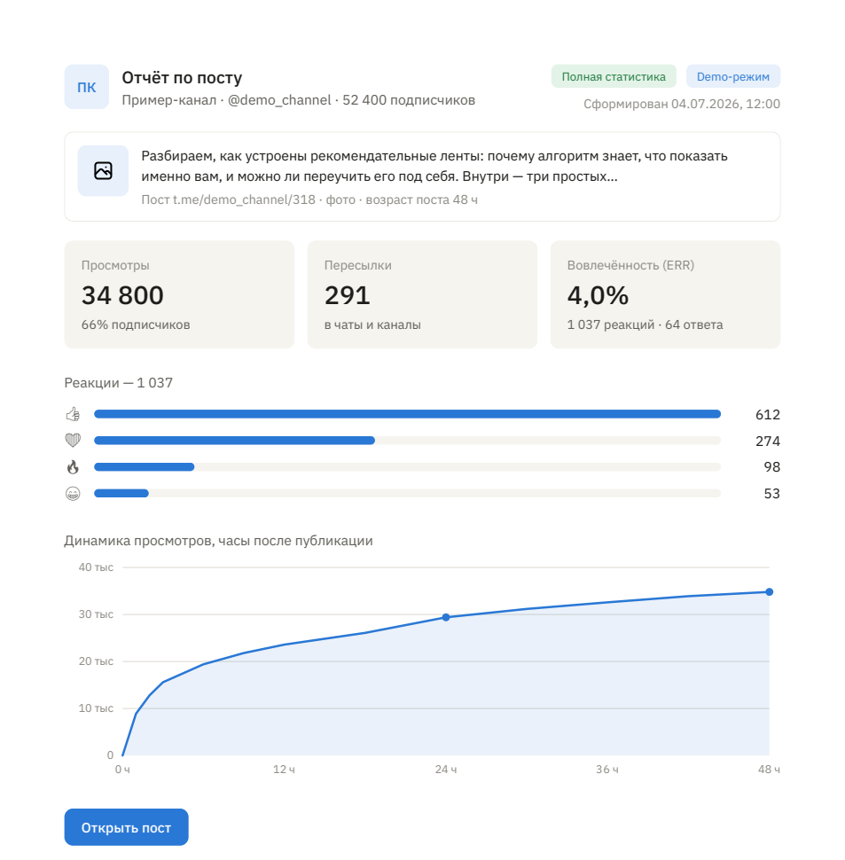
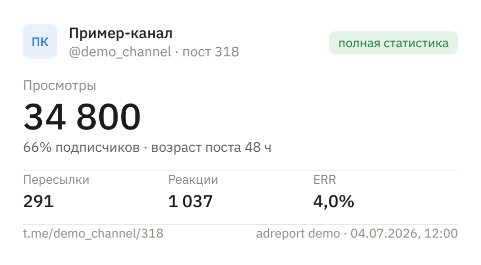

# adreport

Отчёты по постам Telegram-каналов: аккуратный PDF и PNG-карточка вместо
скриншотов из статистики. Ссылка на пост или пересылка боту — на выходе
типовой документ с просмотрами, охватом, пересылками, реакциями и ERR.

Сервис канал-агностик: тематика и бренд нигде не зашиты, работает с любым
публичным каналом; имя, контакт и таймзона — параметры конфига.

<p align="center">
  
</p>

<p align="center">
  
</p>

## Попробовать за 30 секунд — без токенов

```bash
python -m venv .venv && .venv/Scripts/pip install -e ".[dev]"
adreport demo
```

`adreport demo` собирает витринный отчёт из фикстур: кириллица, график
динамики просмотров, разбивка реакций. Ни API-ключей, ни сессий — это
вход для проверяющего и полигон вёрстки. `--public` показывает вариант
«только публичные данные», `--pdf`/`--png` ограничивают формат.
Примеры готовых файлов лежат в [examples/](examples/).

## Отчёт по реальному посту

```bash
cp .env.example .env    # API_ID и API_HASH с my.telegram.org
adreport post https://t.me/канал/123
```

Публичные счётчики видны сессии **любого** аккаунта — админ-доступ не нужен.
При первом запуске Telethon спросит телефон и код; появившийся
`adreport.session` равен доступу к аккаунту, поэтому он в `.gitignore`
с первого коммита.

## Бот

```bash
# в .env добавить BOT_TOKEN (@BotFather) и свой id в ALLOWED_IDS
adreport bot
```

Пересланный пост или сообщение со ссылкой → «принял» → PDF-документ
и PNG-карточка в ответ. Бот приватный по построению: whitelist
`ALLOWED_IDS` отсекает чужие апдейты до роутинга — каждый запрос тратит
лимиты вашей Telethon-сессии, и раздавать это прохожим не стоит.
Если канал скрывает источник пересылок, бот попросит ссылку.

## Design decisions

**Снапшоты, а не поход в Телеграм при генерации.** Каждый сбор пишет
иммутабельный срез в SQLite (только вставки), генератор отчёта читает базу.
Это ~20 строк вместо подсистемы, а взамен: честная плашка «данные на момент N»,
отчёты по уже удалённым постам из последнего среза и мини-динамика при
повторных замерах. Удалённый пост в Телеграме недоступен навсегда — пассивная
защита снапшотами оказалась почти бесплатной.

**Публичные данные — первый класс, а не урезанный режим.** Любой аккаунт
видит у публичного канала просмотры, пересылки, реакции, ответы и подписчиков;
почасовой граф просмотров — только админ. Отчёт по публичным данным — это
полноценный документ с жёлтым бейджем «только публичные данные», где
неприменимые метрики скрыты, а не нарисованы нулями. Деградация вместо отказа.

**CTR в Телеграме не существует.** Платформа не отдаёт клики по ссылкам —
ни админам, ни кому-либо ещё. Единственный честный способ — собственный
шортенер с уникальной ссылкой на размещение; он в дорожной карте (v1.5)
вместе с фильтрацией ботов и превью-краулеров. До тех пор отчёт не
показывает CTR вовсе — лучше отсутствующая метрика, чем выдуманная.

**HTML → PDF, а не ReportLab.** Один Jinja2-шаблон обслуживает и PDF
(WeasyPrint), и PNG-карточку (тот же HTML → одностраничный PDF → растр
pypdfium2): вёрстка правится в CSS, а не в координатах холста, и оба формата
не могут разъехаться. Плата — WeasyPrint не исполняет JS, поэтому график
и бары реакций генерируются серверным SVG. Шрифты вшиты (IBM Plex Sans
400/500/700 отдельными файлами — иначе синтезируется уродливый faux-bold,
Noto Emoji для реакций), а golden-тест в CI рендерит «Ёё Щщ №» и проверяет,
что набор шёл вшитыми шрифтами: квадраты ловятся автоматически.

**Медиана, а не среднее.** Для бенчмарков канала (v1.4) зафиксирован принцип:
медианный охват на выровненном 48-часовом срезе с самоисключением поста из
окна сравнения. Среднее по каналу с одним вирусным постом врёт; медиана — нет.
Принцип записан сейчас, чтобы код v1.4 не пришлось переубеждать.

**Рекламодатель — опция кампании, а не сущность.** В отчёте по посту нет
и не будет обязательного «клиента»: метка рекламодателя появится в v1.3 как
необязательное поле размещения. Инструмент остаётся полезным для любых постов,
а не только рекламных.

**Отчёты иммутабельны.** Каждый отчёт хранит замороженный `ReportData`
с `schema_version`, sha256 эталонного PDF и время генерации; перегенерация —
новый id. Пять строк сегодня — верификация подлинности по QR в v1.1.

## Архитектура

```
ссылка / пересланный пост ──► CLI | Telegram-бот ──► ядро:
    коллектор (Telethon, любой аккаунт)
      → снапшот + превью (SQLite, append-only)
      → сборка (ReportData, schema_version, заморозка)
      → рендер (Jinja2 → PDF | PNG)
```

Интерфейсы ничего не считают, ядро не знает, кто его позвал: новый формат —
файл в `render/`, новый интерфейс — папка рядом с `cli/` и `bot/`.
Постоянного демона нет: `adreport bot` держит сессию и бота в одном процессе,
lock-файл защищает сессию от параллельного запуска (второе подключение одной
сессии — красный флаг антифрода Телеграма).

## Дорожная карта

MVP (v0.1 отчёт из фикстур → v0.2 живой публичный пост → v0.3 бот → v1.0
витрина) завершён. Дальше — по одному обещанию на версию; всё ниже отложено
решением, а не забыто:

- **v1.1 — верификация-лайт.** QR в футере → deep-link бота: канонические
  цифры из замороженного `ReportData` и sha256 эталонного файла.
- **v1.2 — админская глубина.** Опциональная сессия-админ: ретроспективный
  почасовой граф просмотров, настоящая динамика, срезы 1/24/48/72 ч.
- **v1.3 — кампании.** Регистрация размещения пересылкой, форматы
  (1/24 · 2/48 · 3/72), архив контента, twemoji-превью, erid для ОРД.
- **v1.4 — канал и бенчмарки.** Синхронизация истории, `/channel` за период,
  медианы на выровненных срезах.
- **v1.5 — шортенер и CTR.** FastAPI, мгновенный 302, классификация
  человек/бот, fingerprint без хранения сырых IP.
- **v1.6 — живые страницы.** `/r/{id}` из замороженного `ReportData`,
  экспорт CSV/JSON, вторая цель QR.
- **v1.7 — медиакит.** Канал за 30/90 дней: медианные охваты, ER, рост,
  топ-размещения; внутренняя версия с CPM.

Бэклог без привязки к версиям: фоновая архивация `/watch`, таймер финального
слепка, криптоподпись (Ed25519/PAdES), эксплуатационный слой в день первого
реального деплоя.

## Стек и тесты

Python 3.12+ · Telethon · aiogram 3 · SQLAlchemy + SQLite · Jinja2 ·
WeasyPrint · pypdfium2 · Typer · pytest.

```bash
.venv/Scripts/python -m pytest   # 61 тест: метрики, builder, golden-рендер,
                                 # коллектор и бот на моках, хранилище
```

### WeasyPrint на Windows

WeasyPrint нужны нативные библиотеки Pango, которые pip не ставит. Без
установки в систему: распаковать `bin/` (и `etc/fonts/`) из
`GTK3_Gvsbuild_*_x64.zip` ([релизы gvsbuild](https://github.com/wingtk/gvsbuild/releases))
в `.gtk3/` в корне репозитория — рендерер подхватит DLL сам. Альтернативы:
переменная `ADREPORT_GTK_BIN` или MSYS2. На Linux/macOS достаточно системного
пакета pango.

## Лицензия

MIT. Вшитые шрифты — IBM Plex Sans и Noto Emoji — под OFL
(лицензии рядом со шрифтами в `templates/fonts/`).
